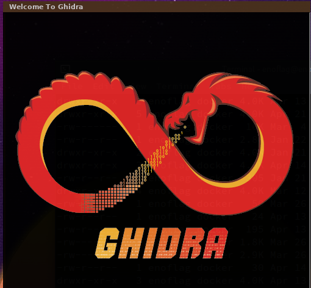
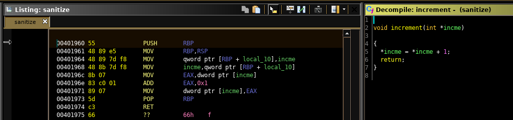
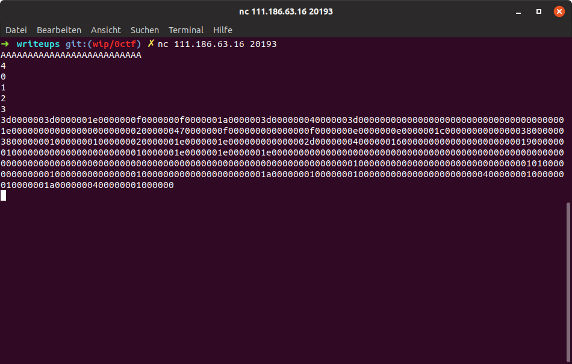
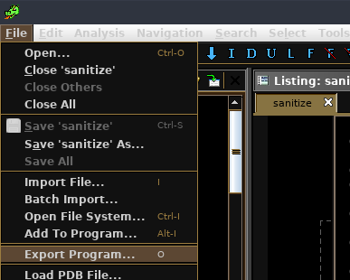
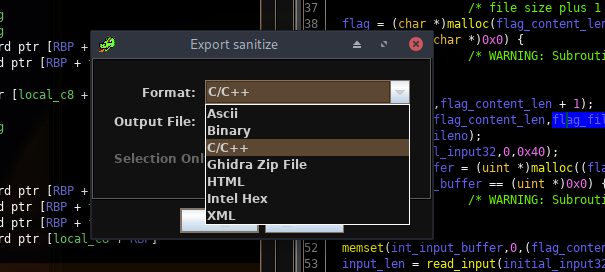

# Sanitize

Decompiling with Ghidra *(domenukk: "I would never")* a CTF Challenge.

Writeup by mmunier and domenukk.



## Intro

Sanitize was a reversing challenge at the 2019 0ctf with 282 points and 29 solves. 

## Reversing

The first thing we noticed was that the whole binary was scattered with a function that merely increments an int at the given memory location.



It's literally everywhere, however always with a different memory location.
We figured out, at some point, that it's some sort of instrumentation, indicating which branches were taken - and how often.

Apart from this, the binary only printed "Invalid" - so first we analyzed what kind of input the binary wants.

The general sequence of events was:

1. Input a string of length < than 32
2. Input a number n <= 4
3. Input n numbers
4. Get some kind of output



For this sequence to work the binary required a file called flag, and it used the numbers as indexes from where to read.

The output, after correct input, was a dump of the memory region with our instrumentation counters, 81 ints in total.

The input, as well as some parts of the flag, get pushed into a binary tree with some kind of sorting.
We figured out the instrumentation depends on the paths taken in the tree implementation, so we started to reverse it.

## Decompiled Trees

*WOAH! Decompilation in C works. All these years they told us it's an unsolved problem...*

The binary first created an empty tree, to which it appended our input character by character. After that it appended the n characters of the flag at the indexes we specified.

We tried to grasp how the tree was behaved.
Wierdly enough, new nodes were always appended at the root of the tree, and it had some kind of self balancing.
However, we had no clue how it balanced.
So we built ripped the tree out and _built our own tool_.

Turns out, Ghidra has an "Export to C/C++ option".




That's right: after a few more changes (the performance counters were undefined in the exported C code, we added some int variables manually), we were able to step through our own source code...

Here is some decompiled source code in VS Code (see [sanitize_tree.c](sanitize_tree.c) for the complete version):

```c
...
// Our instrumentation counters look like this
int enter_new_tree = 0;
int leave_new_tree = 0;

typedef struct tree_node tree_node, *Ptree_node;

void _exit(int no) {
  exit(no);
} 

// This is unchanged, straight from the reversed ghidra struct.
// 0x1 - 0x3 are probably padding bytes, or something unused.
struct tree_node {
    char input_byte;
    undefined field_0x1;
    undefined field_0x2;
    undefined field_0x3;
    uint height_maybe;
    struct tree_node * parent;
    struct tree_node * tree_right;
    struct tree_node * next_or_left;
};


void increment(int *incme)
{
  *incme = *incme + 1;
}
...
```

To better wrap our head around how chars could be deducted from the counters, we added a bit of functionality to the decompiled C Code:  a graphical output of the balanced tree after each added character.

The input AGBDCCAF would result in the following tree:

```sh
 enoflag@enovm  ~/ctf/0ctf19  ./sanitize_tree AGBDCCAF
==============
Round 0: Added [A]:

A  [0]

==============
Round 1: Added [G]:

v---------G  [0]

A  [1]
```

[...]

```sh
==============
Round 6: Added [A]:

A  [0]

          v---------C  [0]

^---------C  [1]

                              v---------D  [0]

                    v---------B  [1]

                              ^---------G  [0]

          ^---------A  [2]

==============
Round 7: Added [F]:

                    v---------D  [0]

          v---------B  [1]

                    ^---------G  [0]

v---------A  [2]

                    v---------C  [0]

          ^---------C  [1]

                    ^---------F  [0]
>>>>>>> added images

A  [3]
```

This was a nice side project, however turned out to be useless in the long run.
While there were some counters which were in the *"sorting"* algorithm of the tree that seemed particularly interesting, we failed to grasp the actual tree-balancing algorithm enough to deduct a relationship between the counter and the input.

This is left as an exercise to the reader, feel free to play around with [the source](sanitize_tree.c).

## From Counter-Dump to Hash Function to Flag

Firstly YES, these counters aren't a good hash function in itself, since they weren't particularly collision resistant: The binary only ever compares two values to decide its path on where to go next.
That meant using the same "base tree" (the first 32 input characters inputted) the character Sequence "aaab" and "aaac" are probably indistinguishable in most of the cases.

The important part of the tree:

```c
if ((byte)next->input_byte < (byte)current->input_byte) {
  if (prev == (tree_node *)0x0) {
    increment(&a_t_smaller_input_null);
    *new_head_ret = next;
  }
  else {
    increment((int *)&a_t_smaller_input_byte);
    prev->next_or_left = next;
  }
  if (current == next) {
            // ptr->input_byte ==, ptr != -> impossible
    increment((int *)&a_t_smaller_input_impossible);
  }
  else {
    ...
```

However, if the right base tree was used "aaab" would end up with slightly different counter values based upon the *"sorting"*.
That meant using the same unknown char sequence on *enough* base trees, they would differ in some of them.

Thinking we would need to create a rainbow table for the needed combinations, we hashed the concatenated output at the end with *md5* to more easily tell if they were unique.

After generating a huge amount of table entries and trying our first attack,
it dawned on me that we could massively reduce the search space, since we partially knew the plaintext `flag{ ..... }`.

Since we could pick characters to our liking it was enough to pick one unknown character, using `$c` + `"lag"` for the string.

This way, it's only necessary to generate one single entry ([generator script](gentable_new.py)) for each of the ~ 100 chars that could end up in the flag, instead of one for each 4 letter combination.

After generating our map locally, we then got one hash for each each character of the actual flag from the remote endpoint by comparing it with our locally generated [rainbow table](table2/table_new2.table) char by char.

After about 1 hour of talking to the service our [exploit](exploit2.py) finally spat out the flag:
_*flag{fr0M_C0vEr4ge_To_Fl4G_And_Enj0Y_0cTF_2Ol9!}*_
