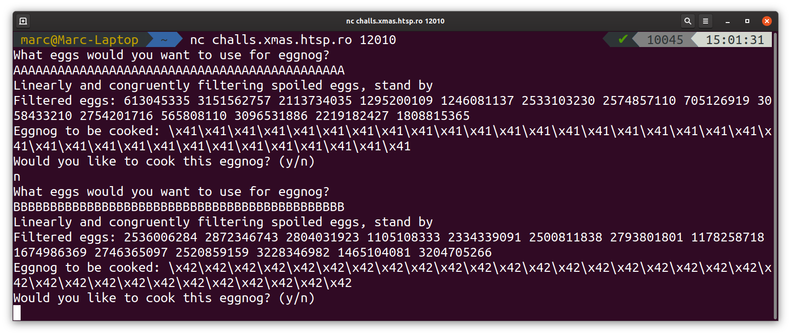

# X-MAS CTF 2019 - Eggnog (pwn)

*21 December 2019 by MMunier* 


## General Overview
Eggnog was a pwn challenge in this (2019's) X-Mas CTF.
This CTF i managed to solve quite a few of their pwn chals so further writeups *may* come.

Eggnog itself was a small challenge that asked a user to provide some eggs for it.



As the text pretty clearly states it filters ones input with a "linear congruent generator" (LCG) in the background.
Those are notorious for being easily predictable as "linear" in the name should give away so it was an immediate red flag.
(Nevertheless searching for "password generator in c" on google is pretty sad considering the rand() function is also a LCG.)

If one would decide to cook the recipe shown in the image the connection would immediately hang indicating that it either jumps to the filtered input as *shellcode* or *ROPping* with it.

Upon playing a few rounds with the service, I went and reversed how exactly the LCG was implemented.

## Reversing

The provided binary was fairly small, not stripped and quick to fully understand. As usual I decided to just throw it into Ghidra. 

In general a LCG genrates numbers by calculating 
`state_{n+1} = m * state_n + c % N`
and then deriving its output based upon the current state.

``` c
long next_lcg(void)

{
  lcg_state = (c + lcg_state * m) % n;
  return lcg_state;
}
```


Looking upon how it was initialized we can see that all parameters of the LCG are generated by a secure source so they can't be predicted by us.

``` c
void init_lcg(void)

{
  FILE *__stream;
  
  __stream = fopen("/dev/urandom","rb");
  fread(&lcg_state,1,4,__stream);
  fread(&n,1,4,__stream);
  fread(&m,1,4,__stream);
  fread(&c,1,4,__stream);
  m = m % n;
  c = c % n;
  fclose(__stream);
  return;
}
```

So we focus our attention to the heart of the program.

``` c

void loop(void)

{
  bool bVar1;
  int iVar2;
  size_t sVar3;
  int local_28;
  int local_24;
  int local_20;
  int local_18;
  int local_14;
  bool end;
  
  end = false;
  while (!end) {
    puts("What eggs would you want to use for eggnog?");
    fgets(code,0x2f,stdin);
    sVar3 = strlen(code);
    iVar2 = (int)sVar3 + -1;
    if (iVar2 < 0x2d) {
      puts("We need more eggs to make good eggnog, kid!");
    }
    else {
      puts("Linearly and congruently filtering spoiled eggs, stand by");
      printf("Filtered eggs: ");
      local_28 = 0x1f;
      while (local_28 < 0x2d) {
                    /* Dump state + params of lcg */
        printf("%lld ",lcg_state);
        removal[(long)(local_28 + -0x1f)] = lcg_state % (long)iVar2;
        next_lcg();
        local_28 = local_28 + 1;
      }
      putchar(10);
      local_24 = 0;
      local_20 = 0;
      while (local_20 < iVar2) {
        bVar1 = false;
        local_18 = 0x1f;
        while (local_18 < 0x2d) {
          if ((long)local_20 == removal[(long)(local_18 + -0x1f)]) {
            bVar1 = true;
          }
          local_18 = local_18 + 1;
        }
        if (!bVar1) {
          new_code[(long)local_24] = code[(long)local_20];
          local_24 = local_24 + 1;
        }
        local_20 = local_20 + 1;
      }
      printf("Eggnog to be cooked: ");
      local_14 = 0;
      while (local_14 < local_24) {
        printf("\\x%hhx",(ulong)(uint)(int)(char)new_code[(long)local_14]);
        local_14 = local_14 + 1;
      }
      putchar(10);
      puts("Would you like to cook this eggnog? (y/n)");
      iVar2 = fgetc(stdin);
      if ((char)iVar2 == 'y') {
        (*(code *)new_code)();
        end = true;
      }
      else {
        fgetc(stdin);
      }
    }
  }
  return;
}
```

The integers outputted by "Filtered eggs" are directly the state of the LCG and are used to kick out chars from our shellcode before jumping to it.

Also important to note that the LCG is **not** reinitialized between attempts when saying no.
This is where the challenge basically shifted to a bit of crypto.

## Finding the LCG Parameters

Just googling for it, it is immediately clear that LCGs are well understood and there are [stackoverflow posts](https://security.stackexchange.com/questions/4268/cracking-a-linear-congruential-generator) for everything. A few of them directed me to this paper: ["How to crack a Linear Congruential Generator"](http://www.reteam.org/papers/e59.pdf) (Now we're once again playing find the crypto-paper ...)

It states that we can find an integer multiple of the modulus by calculating the determinant of following matrix:

```
| seed_n    state_n+1   1 |
| seed_n+1  state_n+2   1 |
| seed_n+2  state_n+3   1 |
```
Since we have more than 4 known states we can calculate this multiple times and then take the GCD (greatest common divisor) of the determinants to get the modulus.

Once we have the modulus N solving for c and m becomes "trivial" (after a bit more stackoverflow).

```
Taking 2 calculations of the next state:

I:  state_n+1 = m * state_n + c     mod N
II: state_n+2 = m * state_n+1 + c   mod N

II - I: 
state_n+1 - state_n+2 = m * state_n+1 - m * state_n + c - c mod N

=>
state_n - state_n+2 = m * (state_n+1 -  state_n)
=> 
m = state_n - state_n+2 * (state_n+1 - state_n)^-1 
```

Taking the multiplicative inverse of something mod N only works when they dont share any factors but that happens often enough to not be an issue further down the line.

Now calculating c becomes trivial (even for me ^^):\
`c = state_n+1 - m * state_n mod N`

With now all parameters known we can now predict the output of the LCG and with that also the filtered chars (output % 0x2d).

## Putting it all together
With the filtered chars known for all rounds after the first input we send it $random_stuff for the first round since we are only interested at the dumped states anyways.\
So we decline the first cooking and prepare our shellcode by predicting the next few outputs and add padding bytes in those places into the shellcode.

Those being filtered out we decide to cook our second course
and get rewarded with a shell and the flag to accompany it:\
*X-MAS{D1nkl3b3rg_w4tch_0ut_f0r_N0g_M4n}*

If you want my messy exploit code click [here](Eggnog_ex.py) (but tbh I can't recommend it). 

All in all nice and easy pwn/crypto challenge.

-- MMunier
