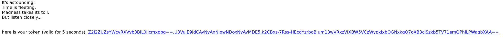
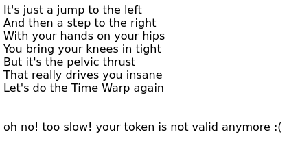

# timewarp

Author: ccmd

Category: web

Solves: 11

Points: 484

!!! challenge will shutdown at approx 01:30 UTC !!!

If you haven't solved it until then, we don't think you'll be able to do it.

## Challenge

You were presented with a website that gave you a choice between `getting a token` and `dancing`.

Once you click on `grab a token` you are redirected to a site where you'd get a line from the lyrics of the song [Time Warp](https://www.youtube.com/watch?v=umj0gu5nEGs) from the Rocky Horror Picture Show. After about 5 seconds the website would provide you with a token that is valid for 5 seconds.

This token could then be submitted. 
The submission process is very similar to getting a token though.
But instead of 5 seconds it would take even longer, so even if you were to script getting the token and submitting it the token would always be invalid by the time it is checked.

## Solution

This seems like an impossible challenge, but as the solves show it really isn't.
The trick here is knowing that in most time zones that have daylight saving time, the 27th of October the clock jumps back an hour. For us that was from 3am to 2am because we switched from CEST to CET (UTC+2 to UTC+1).

That gave us a roughly 30 minutes time window were tokens suddenly were valid again. 
This means to solve this challenge you would generate a token at say 2:20:00 am sharp.
This token would be valid until 2:20:05 am.
Then you'd wait until 3 am where you do the timwarp and the clocks reset.
Now the token that was invalid suddenly becomes valid for 20 minutes and 5 seconds.
This is enough time to submit it and get the Flag.

Flag: `tctf{I remember doing the time-warp. Drinking those moments when. The Blackness would hit me. And the void would be calling...}`
